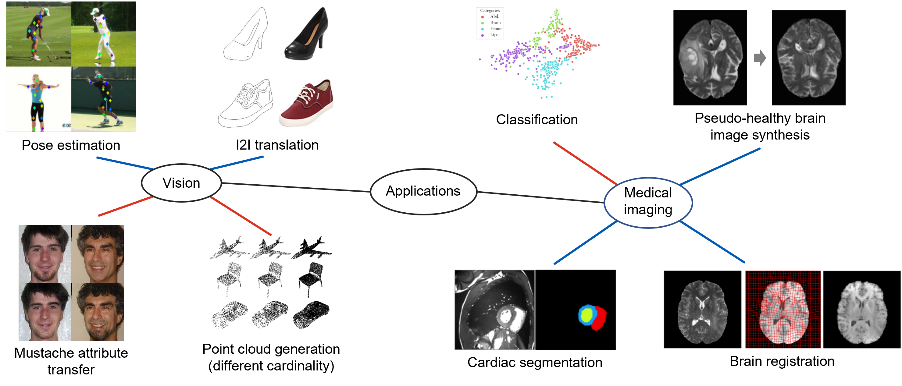

# A tutorial on learning disentangled representations in the imaging domain


Visual summary of disentangled representation learning applications in the computer vision (left) and medical imaging (right) domains. Red connections indicate vector-based disentanglement, while blue connections indicate tensor/vector-based one (CSD). The visual examples aretaken from the

## Applications of Disentanglement
Exemplar methods that exploit disentanglement to improve challenging tasks in computer vision and medical image analysis.

### Computer Vision

|     Task     | Model Abbrev. | Repository | Framework | Type | Original Implementation |
|:------------:|:------:|:--------:|:------:|:------:|:------:|
|I2I translation|MUNIT|[https://github.com/NVlabs/MUNIT](https://github.com/NVlabs/MUNIT) |PyTorch| C-S |<ul><li>- [x] </li>   |
|Face Attribute Transfer|ELEGANT|[https://github.com/Prinsphield/ELEGANT](https://github.com/Prinsphield/ELEGANT)  |PyTorch| Vector |<ul><li>- [x] </li> |
|Pose Estimation| n/a |[https://github.com/CompVis/unsupervised-disentangling](https://github.com/CompVis/unsupervised-disentangling)  |TensorFlow| C-S |<ul><li>- [x] </li> |
|Point cloud Generation|SetVAE|[https://github.com/jw9730/setvae](https://github.com/jw9730/setvae)  |PyTorch| Vector |<ul><li>- [x] </li> |

### Medical Image Analysis
  
|     Task     | Model Abbrev. | Repository | Framework | Original Implementation |
|:------------:|:------:|:--------:|:------:|:------:|
|Single-modal Segmentation|SDNet|[https://github.com/vios-s/anatomy_modality_decomposition](https://github.com/vios-s/anatomy_modality_decomposition) |Keras|C-S |<ul><li>- [x] </li>   |
|Brain Synthesis|n/a|[https://github.com/vios-s/pseudo-healthy-synthesis](https://github.com/vios-s/pseudo-healthy-synthesis)  |Keras| C-S |<ul><li>- [x] </li> |
|Causal Image Synthesis| n/a |[https://github.com/biomedia-mira/deepscm](https://github.com/biomedia-mira/deepscm)  |PyTorch| C-S |<ul><li>- [x] </li> |
|Classification|MIDNET|[https://github.com/qmeng99/mutual-information-based-disentangled-neural-networks](https://github.com/qmeng99/mutual-information-based-disentangled-neural-networks)  |Tensorflow| Vector |<ul><li>- [x] </li> |

Note that the *SDNet* model has also been implemented in PyTorch and has been integrated into the [GaNDLF](https://github.com/CBICA/GaNDLF) framework.

### Citation
  
 ```
@misc{liu2021tutorial,
  author       = "Xiao Liu and Pedro Sanchez and Spyridon Thermos and Alison O'Neil and Sotirios A. Tsaftaris",
  title        = "A tutorial on learning disentangled representations in the imaging domain",
  year         = "2021"
}
```
  
